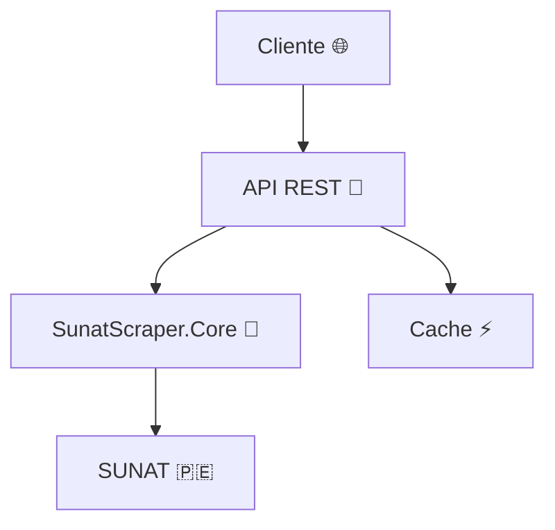

# SUNAT RUC API 🚀🇵🇪

> **Consulta inteligente del RUC desde .NET**

Solución profesional en C# que expone una API ligera para consultar el padrón
de la SUNAT. El captcha se resuelve de forma automática y la estructura está
pensada para integrarse fácilmente en cualquier sistema.

## ✨ Características
- 🔍 **Búsqueda completa** por número de RUC, documento o razón social.
- 🤖 **Captcha automático** resuelto en segundo plano.
- 🌐 **Endpoints HTTP** y servicio **gRPC** opcional.
- 🛡️ **Cache** en memoria y soporte para **Redis**.
- 📄 **Documentación** y ejemplos listos para usar.

## 🛠️ Requisitos
- .NET SDK 9.0 o superior
- Acceso a internet para restaurar paquetes
- Tesseract OCR instalado

## 🚀 Ejecución rápida
```bash
dotnet run --project SunatScraper.Api
```
La API quedará disponible en `http://localhost:5000/`.

## 📁 Endpoints principales
- `GET /` – Comprobación de funcionamiento.
- `GET /ruc/{ruc}` – Consulta por número de RUC.
- `GET /doc/{tipo}/{numero}` – Búsqueda por tipo y número de documento.
- `GET /doc/{tipo}/{numero}/lista` – Devuelve la "Relación de contribuyentes" para el documento indicado.
- `GET /rs/lista?q={razon social}` – Lista de resultados por razón social.
- `GET /rs?q={razon social}` – Búsqueda por nombre o razón social.

## 💻 Ejemplos de uso
### Consulta por RUC
```bash
curl http://localhost:5000/ruc/20100113774
```

### Búsqueda por documento (DNI)
```bash
curl http://localhost:5000/doc/1/73870570
```
### Búsqueda por documento (Carnet de Extranjería)
```bash
curl http://localhost:5000/doc/4/X12345678
```
### Búsqueda por documento (Pasaporte)
```bash
curl http://localhost:5000/doc/7/AB123456
```
### Búsqueda por documento (Cédula Diplomática)
```bash
curl http://localhost:5000/doc/A/CD12345
```
### Obtener lista de resultados para un documento
```bash
curl http://localhost:5000/doc/1/73870570/lista
```

### Obtener lista de resultados por razón social
```bash
curl "http://localhost:5000/rs/lista?q=ACME"
```

### Búsqueda por razón social
```bash
curl "http://localhost:5000/rs?q=ACME"
```
### Búsqueda por razón social con espacios
```bash
curl "http://localhost:5000/rs?q=LOS%20POLLOS%20HERMANOS"
```

### Ejemplo con Redis activado
```bash
Redis=localhost:6379 dotnet run --project SunatScraper.Api
curl http://localhost:5000/ruc/20100113774
```

### Consulta vía gRPC
```bash
grpcurl -d '{"ruc":"20100113774"}' -plaintext localhost:5000 Sunat/GetByRuc
```

## 📄 Arquitectura
El proyecto se compone de tres módulos bien definidos:
- **SunatScraper.Core** – Librería de dominio. Gestiona la lógica de scraping, la validación de entradas, la resolución de captchas y concentra el acceso a la página de SUNAT.
- **SunatScraper.Api** – Capa de presentación HTTP basada en Minimal API. Expone los endpoints REST y configura las dependencias necesarias.
- **SunatScraper.Grpc** – Servicio gRPC opcional pensado para escenarios de alto rendimiento o integración entre microservicios.

### Diagrama general



### Principios arquitectónicos
Se adopta una **arquitectura en capas**. El núcleo de negocio se mantiene aislado en `SunatScraper.Core`, mientras que las capas de presentación consumen dicha librería a través de *inyección de dependencias*. Esto permite cambiar el mecanismo de exposición (REST o gRPC) sin tocar la lógica central y facilita las pruebas unitarias.

Cada capa se comunica mediante interfaces bien definidas, lo que posibilita
reemplazar componentes (por ejemplo, el sistema de cache o el cliente HTTP)
según las necesidades del entorno. De esta forma, la solución puede desplegarse
como un microservicio independiente o integrarse en una aplicación mayor.

#### Flujo de datos
1. El cliente envía una petición REST o gRPC.
2. La capa de API valida los parámetros y delega la consulta al `SunatScraper.Core`.
3. El servicio central se comunica con el portal de SUNAT y almacena temporalmente el resultado en la cache.
4. La respuesta se devuelve al cliente en el formato solicitado.

#### Patrones de diseño
- **Factory Method** en `SunatClient.Create` para configurar `HttpClient` y las opciones de caché.
- **Dependency Injection** para registrar servicios y mantener bajo acoplamiento.
- **Caching** en memoria o Redis para optimizar las consultas repetitivas.

### ¿Por qué C# .NET?
C# es un lenguaje moderno y fuertemente tipado que se ejecuta sobre el runtime
de .NET. Su compilación JIT y las optimizaciones del CLR permiten obtener un
alto rendimiento en aplicaciones de red sin sacrificar la legibilidad del
código. Además, .NET es totalmente multiplataforma: la API puede desplegarse en
Windows, Linux o contenedores Docker sin modificaciones.

La biblioteca estándar ofrece utilidades listas para usar en escenarios de
procesamiento de HTTP, serialización de JSON y manipulación de HTML,
pilares fundamentales de este proyecto. Las facilidades de programación
asíncrona con `async`/`await` simplifican la implementación de clientes web
concurrentes y de servidores de alto rendimiento.

El amplio ecosistema de .NET incluye frameworks integrados para exponer
endpoints REST y servicios gRPC, permitiendo reutilizar la misma lógica de
negocio en distintas formas de comunicación. Gracias a la inyección de
dependencias nativa es sencillo mantener las capas desacopladas y preparar el
código para pruebas automatizadas, facilitando así la mantenibilidad a largo
plazo.

### Despliegue
La aplicación puede publicarse como un ejecutable autocontenible o ejecutarse
dentro de un contenedor Docker, garantizando portabilidad y un proceso de
instalación trivial tanto en entornos de desarrollo como de producción.

En conjunto, C# .NET brinda un balance entre rendimiento, productividad y un
ecosistema maduro. Estas características lo hacen idóneo para implementar la
solución de consulta de RUC que expone esta API.

## 🗂 Estructura del proyecto
```text
.
├── README.md
├── SunatScraper.Api
│   ├── Program.cs
│   └── SunatScraper.Api.csproj
├── SunatScraper.Core
│   ├── Models
│   ├── Services
│   ├── SunatScraper.Core.csproj
│   └── Validation
└── SunatScraper.Grpc
    ├── Services
    ├── SunatScraper.Grpc.csproj
    └── sunat.proto
```

## ⚠️ Advertencia
El portal de SUNAT puede cambiar o tener restricciones de acceso. Este código se comparte con fines educativos y debe usarse respetando los términos de SUNAT.

## 🔘 Solución a error "Captcha request failed: 401 Unauthorized"
Si al realizar una consulta la API muestra `Captcha request failed: 401 Unauthorized`, revisa lo siguiente:

1. Usa la última versión del proyecto. La clase `SunatSecurity` simula un navegador real estableciendo `User-Agent`, `Referer`, `Accept` y `Accept-Language`. También incluye el valor aleatorio `nmagic`/`numRnd` que SUNAT valida para permitir la descarga.
2. Previamente se debe cargar la página `FrameCriterioBusquedaWeb.jsp` para obtener las cookies de sesión. El método `SunatClient.SendAsync` ya realiza esta petición antes de solicitar el captcha.
3. Verifica que tu conexión permita acceder a `e-consultaruc.sunat.gob.pe`; un cortafuego o proxy podría bloquear la descarga del captcha o descartar las cookies.
4. Asegúrate de tener instalado Tesseract OCR para que el captcha se resuelva automáticamente. Si Tesseract no está disponible se solicitará ingresarlo manualmente.
5. A partir de la versión actual la clase `SunatSecurity` detecta los códigos `401 Unauthorized` y `404 Not Found` devolviendo un captcha vacío cuando SUNAT lo omite, evitando que se genere una excepción.

Tras comprobar estos puntos la API debería responder correctamente a las consultas `/ruc/{ruc}`.
