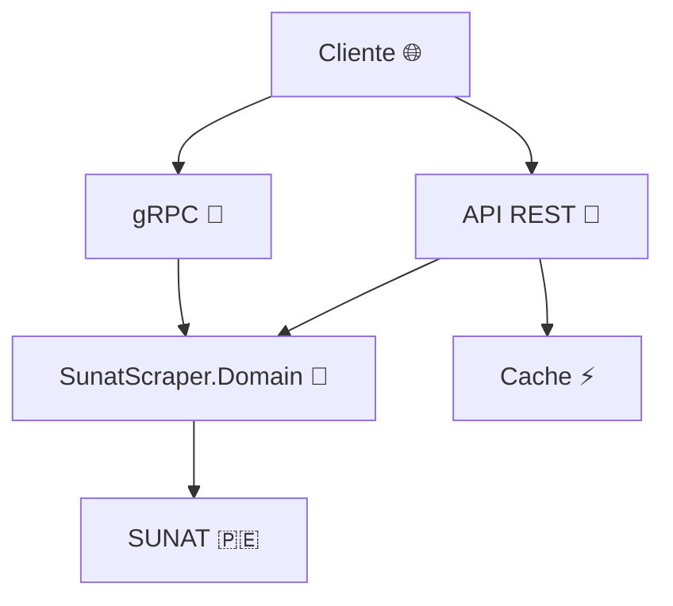
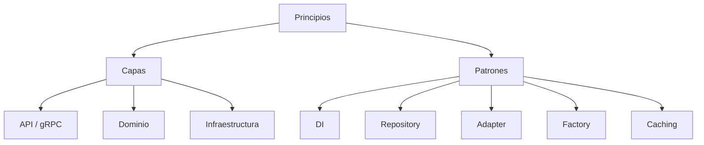
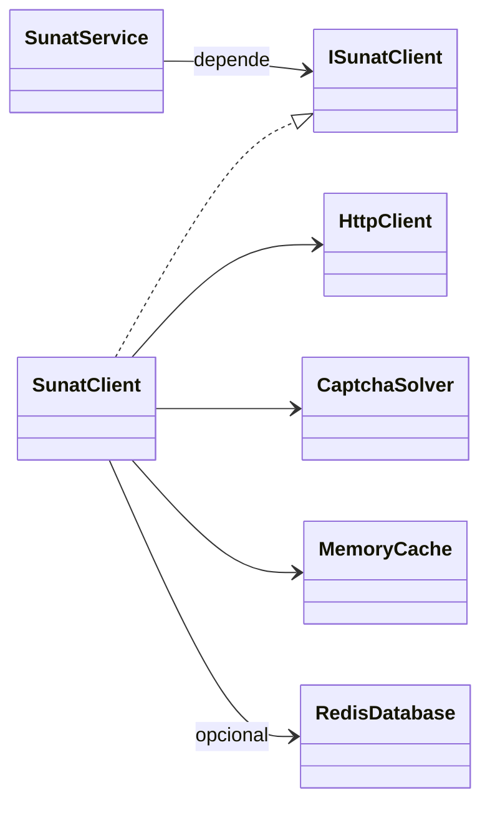

# SUNAT RUC API 🚀🇵🇪

> **Consulta inteligente del RUC desde .NET**

Solución profesional en C# que expone una API ligera para consultar el padrón
de la SUNAT. El captcha se resuelve de forma automática y la estructura está
pensada para integrarse fácilmente en cualquier sistema.

## ✨ Características
- 🔍 **Búsqueda completa** por número de RUC, documento o razón social.
- 🤖 **Captcha automático** resuelto en segundo plano.
- 🌐 **Endpoints HTTP** y servicio **gRPC** opcional.
- 🛡️ **Cache** en memoria y soporte para **Redis**.
- 💥 **Consulta múltiple** de RUCs en paralelo con `Task.WhenAll`.
- 📄 **Documentación** y ejemplos listos para usar.

## 🛠️ Requisitos
- .NET SDK 9.0 o superior
- Acceso a internet para restaurar paquetes
- Tesseract OCR instalado

## 🚀 Ejecución rápida
```bash
dotnet run --project SunatScraper.Api
```
La API quedará disponible en `http://localhost:5000/`.

## 📁 Endpoints principales

| Método | Endpoint | Descripción |
|--------|----------|-------------|
| `GET`  | `/` | Comprobación de funcionamiento |
| `GET`  | `/ruc/{ruc}` | Consulta por número de RUC |
| `GET`  | `/rucs?r={ruc}` | Consulta varios RUCs en paralelo |
| `GET`  | `/doc/{tipo}/{numero}` | Búsqueda por tipo y número de documento |
| `GET`  | `/doc/{tipo}/{numero}/lista` | Devuelve la "Relación de contribuyentes" para el documento indicado |
| `GET`  | `/rs/lista?q={razon social}` | Lista de resultados por razón social |
| `GET`  | `/rs?q={razon social}` | Búsqueda por nombre o razón social (incluye `ubicacion` cuando está disponible) |

## 💻 Ejemplos de uso

<details>
<summary>Consulta por RUC</summary>

```bash
curl http://localhost:5000/ruc/20100113774
```
</details>

<details>
<summary>Consulta múltiple de RUCs</summary>

```bash
curl "http://localhost:5000/rucs?r=20100113774&r=20600055576"
```
</details>

<details>
<summary>Búsqueda por documento (DNI)</summary>

```bash
curl http://localhost:5000/doc/1/73870570
```
</details>

<details>
<summary>Búsqueda por documento (Carnet de Extranjería)</summary>

```bash
curl http://localhost:5000/doc/4/X12345678
```
</details>

<details>
<summary>Búsqueda por documento (Pasaporte)</summary>

```bash
curl http://localhost:5000/doc/7/AB123456
```
</details>

<details>
<summary>Búsqueda por documento (Cédula Diplomática)</summary>

```bash
curl http://localhost:5000/doc/A/CD12345
```
</details>

<details>
<summary>Obtener lista de resultados para un documento</summary>

```bash
curl http://localhost:5000/doc/1/73870570/lista
```
</details>

<details>
<summary>Obtener lista de resultados por razón social</summary>

```bash
curl "http://localhost:5000/rs/lista?q=ACME"
```
</details>

<details>
<summary>Búsqueda por razón social</summary>

```bash
curl "http://localhost:5000/rs?q=ACME"
```
</details>

<details>
<summary>Búsqueda por razón social con espacios</summary>

```bash
curl "http://localhost:5000/rs?q=LOS%20POLLOS%20HERMANOS"
```
</details>

<details>
<summary>Ejemplo con Redis activado</summary>

```bash
Redis=localhost:6379 dotnet run --project SunatScraper.Api
curl http://localhost:5000/ruc/20100113774
```
</details>

<details>
<summary>Consulta vía gRPC</summary>

```bash
grpcurl -d '{"ruc":"20100113774"}' -plaintext localhost:5000 Sunat/GetByRuc
```
</details>

## 📄 Arquitectura
El proyecto se compone de cuatro módulos bien definidos:
- **SunatScraper.Domain** – Librería de dominio. Gestiona la lógica de scraping, la validación de entradas, la resolución de captchas y concentra el acceso a la página de SUNAT.
- **SunatScraper.Infrastructure** – Implementación del cliente HTTP y la caché.
- **SunatScraper.Api** – Capa de presentación HTTP basada en Minimal API. Expone los endpoints REST y configura las dependencias necesarias.
- **SunatScraper.Grpc** – Servicio gRPC opcional pensado para escenarios de alto rendimiento o integración entre microservicios.

### Diagrama general



### Principios arquitectónicos
> 🏗️ **Arquitectura en capas**  
> `SunatScraper.Domain` concentra la lógica de negocio y se consume mediante
> *inyección de dependencias*. De esta manera la API puede exponerse por REST o
> gRPC sin tocar el núcleo y se facilitan las pruebas unitarias.

> 🔌 **Componentes intercambiables**
> Cada módulo se comunica a través de interfaces, permitiendo reemplazar el
> sistema de cache o el cliente HTTP según el entorno. Así es posible desplegar
> la solución como microservicio o integrarla en una aplicación mayor.
> 🚀 **Asincronía por defecto**
> Todas las operaciones son `async` y algunas consultas se ejecutan en paralelo
> para aprovechar al máximo los recursos de la aplicación.



#### Flujo de datos
1. 📨 El cliente envía una petición REST o gRPC.
2. 🛂 La API valida los parámetros y delega la consulta a `SunatScraper.Domain`.
3. 🌐 El servicio central consulta el portal de SUNAT (en paralelo cuando se reciben varios RUCs) y guarda temporalmente la respuesta en la cache.
4. 📦 La API devuelve el resultado al cliente.

#### Patrones de diseño
- 🏭 **Factory Method** en `SunatClient.Create` para configurar `HttpClient` y la caché.
- 🧩 **Dependency Injection** para registrar servicios y mantener bajo acoplamiento.
- 📚 **Repository** mediante la interfaz `ISunatClient` que abstrae las consultas al portal y permite reutilizar la lógica en REST y gRPC.
- 🔌 **Adapter**: `SunatClient` implementa dicha interfaz, pudiendo reemplazarse por mocks o variantes según el contexto.
- ⚡ **Caching** en memoria o Redis para optimizar las consultas repetitivas.
- ⚙️ **Asynchronous Pattern** con `async`/`await` y `Task.WhenAll` para consultas paralelas.

### Implementación de patrones en C# .NET

El método `SunatClient.Create()` actúa como **fábrica** al construir y configurar
las dependencias necesarias (`HttpClient`, `MemoryCache` y opcionalmente
`Redis`). Esta instancia se registra mediante inyección de dependencias en
`Program.cs`, de modo que la API REST y el servicio gRPC obtengan un
`ISunatClient` listo para usar.

Las consultas de RUC se implementan de forma **asíncrona** y pueden ejecutarse
en paralelo gracias al método `GetByRucsAsync`, que combina varias tareas con
`Task.WhenAll` para obtener la información más rápido.

`ISunatClient` funciona como **repositorio**: reúne todas las operaciones de
consulta al padrón en una única interfaz, manteniendo la lógica de acceso remoto
separada del resto del dominio.

`SunatClient` implementa esa interfaz y sirve de **adaptador** entre las
llamadas de alto nivel y las peticiones HTTP al portal de SUNAT. Esto permite
intercambiar la implementación por un mock en pruebas o por otra fuente de datos
en caso de que el portal cambie.



### ¿Por qué C# .NET?

El ecosistema .NET proporciona soporte directo para la inyección de
dependencias y para la programación asíncrona con `Task`, lo que simplifica la
implementación de patrones como los mencionados anteriormente. Las clases
genéricas y los contenedores de inversión de control permiten reutilizar los
componentes en distintos proyectos sin cambios.

> C# es un lenguaje moderno y fuertemente tipado que se ejecuta sobre el runtime de .NET. Su compilación JIT y las optimizaciones del CLR permiten obtener un alto rendimiento en aplicaciones de red sin sacrificar la legibilidad del código. Además, .NET es completamente multiplataforma: la API puede desplegarse en Windows, Linux o contenedores Docker sin modificaciones.
>
> La biblioteca estándar ofrece utilidades listas para usar en escenarios de procesamiento de HTTP, serialización de JSON y manipulación de HTML, pilares fundamentales de este proyecto. Las facilidades de programación asíncrona con `async`/`await` simplifican la implementación de clientes web concurrentes y de servidores de alto rendimiento.
>
> El amplio ecosistema de .NET incluye frameworks integrados para exponer endpoints REST y servicios gRPC, permitiendo reutilizar la misma lógica de negocio en distintas formas de comunicación. Gracias a la inyección de dependencias nativa es sencillo mantener las capas desacopladas y preparar el código para pruebas automatizadas, facilitando así la mantenibilidad a largo plazo.

- 🏎️ **Alto rendimiento** gracias a la compilación JIT del CLR.
- 🖥️ **Multiplataforma**: ejecuta la API en Windows, Linux o contenedores Docker.
- 📚 **Biblioteca estándar completa** para HTTP, JSON y HTML.
- 😌 **Asincronía sencilla** con `async`/`await` para clientes y servidores eficientes.
- 🔌 **Frameworks integrados** para REST y gRPC con la misma lógica de negocio.
- 🔧 **Inyección de dependencias** nativa que facilita las pruebas y el mantenimiento.

### Despliegue
La aplicación puede publicarse como un ejecutable autocontenible o ejecutarse
dentro de un contenedor Docker, garantizando portabilidad y un proceso de
instalación trivial tanto en entornos de desarrollo como de producción.

En conjunto, C# .NET brinda un balance entre rendimiento, productividad y un
ecosistema maduro. Estas características lo hacen idóneo para implementar la
solución de consulta de RUC que expone esta API.

## 🗂 Estructura del proyecto
```text
.
├── SunatScraper.Api
│   ├── Program.cs
│   └── SunatScraper.Api.csproj
├── SunatScraper.Domain
│   ├── ISunatClient.cs
│   ├── Models/
│   └── Validation/
├── SunatScraper.Infrastructure
│   ├── Services/
│   │   ├── Parsing/
│   │   └── Security/
│   └── SunatScraper.Infrastructure.csproj
├── SunatScraper.Grpc
│   ├── Services/
│   ├── SunatService.proto
│   └── SunatScraper.Grpc.csproj
```

## ⚠️ Advertencia
El portal de SUNAT puede cambiar o tener restricciones de acceso. Este código se comparte con fines educativos y debe usarse respetando los términos de SUNAT.


## 🔘 Solución a error "Captcha request failed: 401 Unauthorized"
Si al realizar una consulta la API muestra `Captcha request failed: 401 Unauthorized`, revisa lo siguiente:

1. Usa la última versión del proyecto. La clase `CaptchaSolver` simula un navegador real estableciendo `User-Agent`, `Referer`, `Accept` y `Accept-Language`. También incluye el valor aleatorio `nmagic`/`numRnd` que SUNAT valida para permitir la descarga.
2. Previamente se debe cargar la página `FrameCriterioBusquedaWeb.jsp` para obtener las cookies de sesión. El método `SunatClient.SendRawAsync` ya realiza esta petición antes de solicitar el captcha.
3. Verifica que tu conexión permita acceder a `e-consultaruc.sunat.gob.pe`; un cortafuego o proxy podría bloquear la descarga del captcha o descartar las cookies.
4. Asegúrate de tener instalado Tesseract OCR para que el captcha se resuelva automáticamente. Si Tesseract no está disponible se solicitará ingresarlo manualmente.
5. A partir de la versión actual la clase `CaptchaSolver` detecta los códigos `401 Unauthorized` y `404 Not Found` devolviendo un captcha vacío cuando SUNAT lo omite, evitando que se genere una excepción.

Tras comprobar estos puntos la API debería responder correctamente a las consultas `/ruc/{ruc}`.
